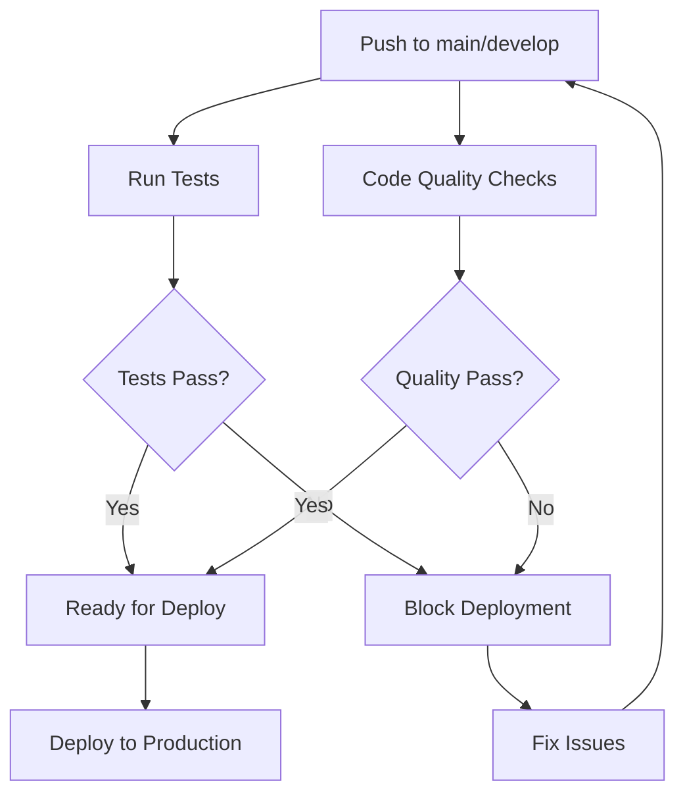

# 🚀 GitHub Actions Workflows

Dự án này sử dụng GitHub Actions để tự động hóa việc testing, kiểm tra code quality và deployment. Dưới đây là mô tả chi tiết về các workflow:

## 📋 Danh sách Workflows

### 1. 🧪 `tests.yml` - Continuous Integration
**Trigger:** Mỗi push và pull request tới `main` hoặc `develop`

**Chức năng:**
- ✅ Chạy Unit Tests (PHPUnit)
- ✅ Chạy Feature Tests (PHPUnit) 
- ✅ Tạo báo cáo coverage
- ✅ Kiểm tra code style (Laravel Pint)
- ✅ Security audit
- ✅ Test matrix với PHP 8.2 và 8.3

### 2. 🔍 `code-quality.yml` - Code Quality Checks
**Trigger:** Mỗi push và pull request tới `main` hoặc `develop`

**Chức năng:**
- 🎨 Code style checking (Laravel Pint)
- 📏 Static analysis (PHPStan)
- 🔐 Security vulnerabilities scan
- 📊 Code quality metrics (PHP Insights)

### 3. 🚀 `deploy.yml` - Production Deployment
**Trigger:** Push tới branch `main`

**Chức năng:**
- 🧪 Chạy toàn bộ test suite trước khi deploy
- 📦 Build production assets
- 🚀 Deploy qua FTP tới production server
- ✅ Chỉ deploy khi tất cả tests PASS

## 🔧 Cấu hình Requirements

### Secrets cần thiết:
```
FTP_HOST=your-ftp-host.com
FTP_PORT=21
FTP_USERNAME=your-username
FTP_PASSWORD=your-password
```

### Environment Variables:
```
SUPABASE_URL=https://your-project.supabase.co
SUPABASE_ANON_KEY=your-anon-key
```

## 📊 Test Coverage

Các test được chia thành 2 test suites:

### Unit Tests
- `SupabaseServiceTest` - 10 tests
- `UserModelTest` - 12 tests  
- `ValidationTest` - 11 tests

### Feature Tests
- `AuthControllerTest` - 6 tests
- `SupabaseUserControllerTest` - 8 tests
- `CourseControllerTest` - 10 tests
- `GameControllerTest` - 8 tests
- `RouteTest` - 6 tests

## 🚦 Workflow Status

| Workflow | Status | Description |
|----------|--------|-------------|
| Tests |  | Unit & Feature Tests |
| Code Quality |  | Code Standards |
| Deploy |  | Production Deployment |

## 📈 Best Practices

### Để đảm bảo CI/CD hoạt động tốt:

1. **Viết tests cho mọi feature mới**
   ```bash
   php artisan test --testsuite=Unit
   php artisan test --testsuite=Feature
   ```

2. **Kiểm tra code style trước khi commit**
   ```bash
   ./vendor/bin/pint --test
   ```

3. **Chạy security audit định kỳ**
   ```bash
   composer audit
   ```

4. **Đảm bảo test coverage ≥ 80%**
   ```bash
   php artisan test --coverage-text
   ```

## 🐛 Troubleshooting

### Tests fail?
- Kiểm tra log trong GitHub Actions
- Chạy tests locally: `php artisan test`
- Đảm bảo `.env.example` có đầy đủ variables

### Deployment fail?
- Kiểm tra FTP credentials trong Secrets
- Đảm bảo tất cả tests pass trước khi deploy
- Kiểm tra file permissions trên server

### Code quality issues?
- Chạy `./vendor/bin/pint` để fix code style
- Kiểm tra PHPStan errors và fix logic issues
- Review security audit warnings

## 🔄 Workflow Flow



---
*Generated by Laravel Learning Management System CI/CD Pipeline*