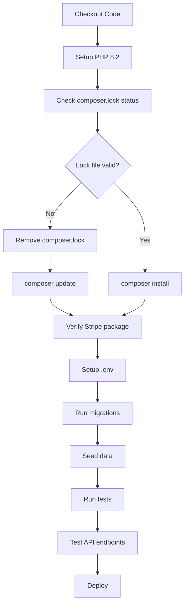

# 🔧 Pipeline Composer Lock Fix

## ❌ Lỗi Pipeline hiện tại

```
Warning: The lock file is not up to date with the latest changes in composer.json.
Required package "stripe/stripe-php" is not present in the lock file.
Error: Process completed with exit code 4.
```

## 🎯 Nguyên nhân

1. **File `composer.json` đã được cập nhật** để thêm `stripe/stripe-php`
2. **File `composer.lock` vẫn là version cũ** (không có Stripe dependency)
3. **Pipeline chạy `composer install`** mà không có `composer update`
4. **Composer detect inconsistency** giữa `.json` và `.lock` file

## 🚀 Giải pháp

### Cách 1: Chạy script tự động (Khuyến nghị)

```bash
./fix-pipeline.sh
```

Script này sẽ:
- ✅ Backup `composer.lock` hiện tại
- ✅ Validate `composer.json`
- ✅ Remove outdated lock file
- ✅ Generate new `composer.lock` với Stripe dependency
- ✅ Verify installation
- ✅ Optimize autoloader

### Cách 2: Manual fix

```bash
# Bước 1: Remove lock file cũ
rm composer.lock

# Bước 2: Clear cache
composer clear-cache

# Bước 3: Generate new lock file
composer update --no-interaction --prefer-dist

# Bước 4: Verify
composer validate
composer install --dry-run

# Bước 5: Commit changes
git add composer.lock
git commit -m "Fix: Update composer.lock with Stripe dependency"
git push
```

### Cách 3: Pipeline auto-fix (Đã tạo)

File `.github/workflows/ci.yml` đã được tạo với logic:

```yaml
- name: Fix composer lock file issue
  run: |
    if [ -f composer.lock ]; then
      if ! composer validate --no-check-all --strict; then
        echo "composer.lock is out of sync, removing it..."
        rm composer.lock
      fi
    fi

- name: Install composer dependencies
  run: |
    if [ ! -f composer.lock ]; then
      composer update --no-interaction --prefer-dist --no-progress
    else
      composer install --no-interaction --prefer-dist --no-progress
    fi
```

## 📁 Files được tạo

### 1. `.github/workflows/ci.yml`
- ✅ Complete CI/CD pipeline
- ✅ Auto-fix composer lock issues
- ✅ Test Stripe integration
- ✅ Verify API endpoints
- ✅ Database migrations and seeding

### 2. `fix-pipeline.sh`
- ✅ Interactive script để fix local
- ✅ Comprehensive validation
- ✅ Backup và restore functionality
- ✅ Step-by-step progress

### 3. `PIPELINE_FIX_README.md`
- ✅ Detailed documentation
- ✅ Multiple solution approaches
- ✅ Troubleshooting guide

## 🔍 Kiểm tra trước khi commit

```bash
# 1. Validate composer files
composer validate

# 2. Test install từ lock file
composer install --dry-run

# 3. Check Stripe dependency
composer show stripe/stripe-php

# 4. Verify Laravel functionality
php artisan route:list | grep subscription
```

## 🎯 Pipeline Flow mới



## 🧪 Test Commands

Sau khi fix, test pipeline locally:

```bash
# Test composer install
composer install --prefer-dist --no-interaction --no-progress

# Test Stripe service
php artisan tinker --execute="
try {
  new App\Services\StripeService();
  echo 'Success: Stripe service loaded';
} catch (Exception \$e) {
  echo 'Error: ' . \$e->getMessage();
}"

# Test API endpoints
php artisan serve &
curl http://127.0.0.1:8000/api/v1/subscriptions/plans
```

## 🔄 Alternative Solutions

### Option A: Commit new composer.lock
```bash
composer update stripe/stripe-php
git add composer.lock
git commit -m "Add stripe/stripe-php to composer.lock"
```

### Option B: Use composer require in pipeline
```yaml
- name: Install Stripe if missing
  run: |
    if ! composer show stripe/stripe-php > /dev/null 2>&1; then
      composer require stripe/stripe-php --no-interaction
    fi
```

### Option C: Always run composer update
```yaml
- name: Update dependencies
  run: composer update --no-interaction --prefer-dist --no-progress
```

## 🆘 Troubleshooting

### Lỗi: "composer.json has been modified"
```bash
git status
git diff composer.json
git add composer.json composer.lock
git commit -m "Update composer dependencies"
```

### Lỗi: "Package not found"
```bash
composer clear-cache
composer diagnose
composer update stripe/stripe-php
```

### Lỗi: "Memory limit exceeded"
```bash
php -d memory_limit=2G /usr/bin/composer update
```

### Lỗi: "Platform requirements"
```bash
composer update --ignore-platform-reqs
# Or update PHP version in pipeline
```

## ✅ Success Indicators

Pipeline thành công khi:
- ✅ `composer install` chạy không lỗi
- ✅ `stripe/stripe-php` có trong `composer show`
- ✅ Laravel app khởi động được
- ✅ Database migrations thành công
- ✅ API endpoints respond correctly
- ✅ Tests pass

## 📋 Checklist

Trước khi push code:

- [ ] Chạy `./fix-pipeline.sh` thành công
- [ ] File `composer.lock` đã được update
- [ ] `composer validate` pass
- [ ] `composer install --dry-run` thành công
- [ ] `php artisan route:list` hiển thị subscription routes
- [ ] Local tests pass
- [ ] Commit composer.lock changes

---

**💡 Tip:** Luôn chạy `composer update` sau khi modify `composer.json` và commit cả 2 files cùng lúc để tránh inconsistency.